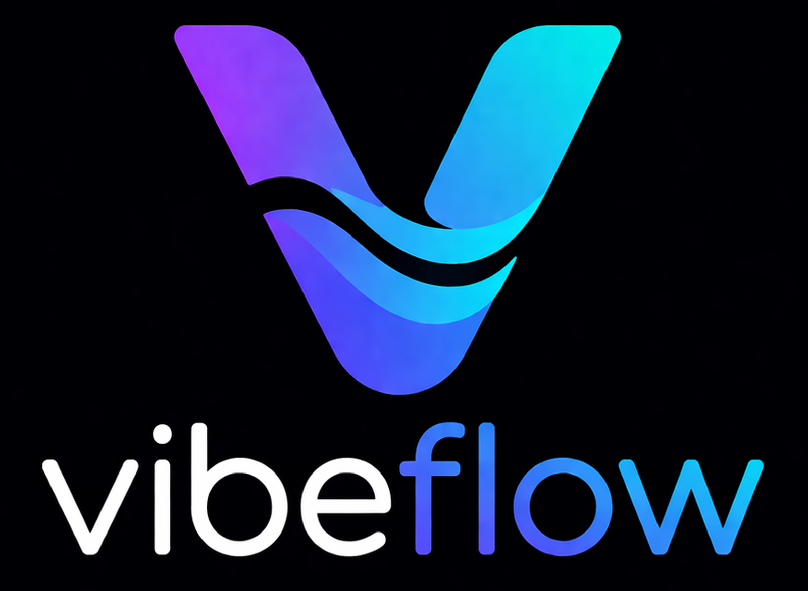

<p align="center">
  
</p>

<p align="center"><em>A GPU-accelerated Linux terminal that knows when your AI tool is waiting on you.</em></p>

<p align="center">
  <a href="https://github.com/bjhengen/vibeflow/actions/workflows/ci.yml"></a>
  <a href="https://crates.io/crates/vibeflow"></a>
  <a href="https://www.npmjs.com/package/vibeflow-protocol"></a>
  <a href="#license"></a>
</p>

## The idea

A modern terminal renders glyphs faster, but it doesn't know what's happening inside it. vibeflow does: every tab carries a small indicator stripe showing whether the program inside is **working**, **waiting on you**, or **idle**. That awareness becomes especially valuable with AI assistants — you can glance at the tab bar and tell at a distance which conversations need you back, without alt-tabbing through them.

State arrives via the **OSC 1338 protocol**, an open standard for AI-tool state signalling in terminals — published in this repo as a [Rust crate](https://crates.io/crates/vibeflow-protocol) and a [TypeScript binding](https://www.npmjs.com/package/vibeflow-protocol).

## How vibeflow learns the state

Three tiers, in priority order:

1. **Tier 1 — Native OSC 1338.** The AI tool emits a one-shot escape sequence on each state transition (`working`, `waiting`, `idle`). Used today for Claude Code via shell-hook configuration (see Quick start).
2. **Tier 2 — Wrapper shims.** Drop-in launchers (e.g. `vibeflow-claude`) that watch the tool's output and emit OSC 1338 on its behalf — for tools that don't natively support it. *(Planned, post-v0.1.)*
3. **Tier 3 — `/proc` heuristic.** As a fallback for tools in the configured AI list, vibeflow infers state from foreground-process activity and output silence. Lower-fidelity, but works for unknown tools.

## Features (v0.1)

- GPU rendering (wgpu) — fast, smooth scrollback.
- Multiple tabs with per-tab AI-state indicator + title.
- Full iTerm2 color-scheme import (`vibeflow --import-colors <path>`).
- Truecolor, italics, color emoji.
- Configurable bell (`visual` / `audible` / `both` / `silent`, debounced).
- Block (Alt+drag) and shift-extend selection; clipboard via arboard.
- xterm-style modifier arrow keys.
- Hot-reload config (`~/.config/vibeflow/config.toml`).
- OSC 1338 native AI-state + `/proc` heuristic fallback.
- OSC 52 clipboard write (for `vim "+y`, tmux pass-through, remote SSH copy)
  — read intentionally not implemented for security reasons.

## Install

### crates.io (recommended)

```sh
cargo install vibeflow
```

You'll also want the protocol crate for the `vibeflow-emit` CLI used by AI-tool hooks:

```sh
cargo install vibeflow-protocol
```

### AppImage (single file, no toolchain)

Download `vibeflow-x86_64.AppImage` from the [latest release](https://github.com/bjhengen/vibeflow/releases/latest):

```sh
chmod +x vibeflow-x86_64.AppImage
./vibeflow-x86_64.AppImage
```

Built on `ubuntu-latest` (x86_64). On older distros, prefer `cargo install` or build from source.

### From source

```sh
git clone https://github.com/bjhengen/vibeflow.git
cd vibeflow
cargo build --release
./target/release/vibeflow
```

## Quick start

Launch `vibeflow`. New tab: `Ctrl+Shift+T`. Cycle tabs: `Ctrl+Tab` / `Ctrl+Shift+Tab`.

### Make AI-state work with Claude Code

Add these hooks to `~/.claude/settings.json` so Claude Code reports its state to vibeflow (the **five-hook** set — fewer than five and you'll see spurious flickering during multi-tool-call turns; this is a Claude Code semantic, not a vibeflow bug):

```json
{
  "hooks": {
    "UserPromptSubmit": [{"hooks": [{"type": "command", "command": "vibeflow-emit working --tool=claude"}]}],
    "PreToolUse":       [{"matcher": "*", "hooks": [{"type": "command", "command": "vibeflow-emit working --tool=claude"}]}],
    "PostToolUse":      [{"matcher": "*", "hooks": [{"type": "command", "command": "vibeflow-emit working --tool=claude"}]}],
    "Stop":             [{"hooks": [{"type": "command", "command": "vibeflow-emit waiting --tool=claude"}]}],
    "Notification":     [{"hooks": [{"type": "command", "command": "vibeflow-emit waiting --tool=claude"}]}]
  }
}
```

For other tools (Codex, opencode, aider, …) — the same shape if the tool exposes equivalent hooks. Until Tier-2 wrapper shims land, the Tier-3 `/proc` heuristic is the fallback (lower-fidelity).

### Plain-shell caveat

vibeflow is a faithful renderer of the signals it receives. A **bare shell** (no OSC 133 prompt-marker integration, no AI tool) emits no state signal — so a tab that was previously in **waiting** state (amber) can legitimately persist amber until the next AI-tool turn or until OSC 133 prompt markers are enabled in your `PS1`. This is the intended *"needs you, still unacknowledged"* semantics, not a stuck state. Bash users wanting prompt-driven recovery in plain shells should enable OSC 133 in their prompt; a typical addition:

```sh
# In ~/.bashrc (after any other PS1 customisation)
PS1='\[\e]133;A\a\]'"$PS1"'\[\e]133;B\a\]'
PROMPT_COMMAND='printf "\e]133;D\a"'"${PROMPT_COMMAND:+;$PROMPT_COMMAND}"
```

## Configuration

Config lives at `~/.config/vibeflow/config.toml` and hot-reloads on save. Themes are imported as iTerm2 `.itermcolors` files:

```sh
vibeflow --import-colors path/to/scheme.itermcolors [--overwrite]
```

Themes land in `~/.config/vibeflow/themes/` and can be selected via the tab context menu or the `[colors] preset` config key.

The `waiting`-state indicator pulses by default. Over VNC (or another remote/software X server) that continuous animation can cause full-screen flicker — each pulse frame re-presents the whole surface, which the remote re-encodes as a full-screen update. Render the indicator steady instead with:

```toml
[ui]
indicator_pulse = false
```

Local GPU displays are unaffected and can keep the default.

Keybindings (default; configurable):

| Action | Shortcut |
|---|---|
| New tab | `Ctrl+Shift+T` |
| Close tab | `Ctrl+Shift+W` |
| Next tab | `Ctrl+Tab` |
| Previous tab | `Ctrl+Shift+Tab` |
| Copy | `Ctrl+Shift+C` |
| Paste | `Ctrl+Shift+V` |
| Scrollback up/down | `Shift+PgUp` / `Shift+PgDn` |

## Protocol

The OSC 1338 wire format is specified in [`docs/protocol.md`](docs/protocol.md). Reference implementations:

- Rust: [`vibeflow-protocol`](https://crates.io/crates/vibeflow-protocol) (includes the `vibeflow-emit` CLI).
- TypeScript: [`vibeflow-protocol`](https://www.npmjs.com/package/vibeflow-protocol) on npm.

## Contributing / testing

See [`docs/TESTING.md`](docs/TESTING.md) for the local test matrix. CI runs `cargo fmt --check`, `cargo clippy -D warnings`, `cargo test --workspace --all-targets`, `cargo doc`, a 60-second protocol fuzz, and the npm binding build/test.

## License

Dual-licensed under either of:

- Apache License 2.0 ([LICENSE-APACHE](LICENSE-APACHE))
- MIT License ([LICENSE-MIT](LICENSE-MIT))

at your option.

---

*vibeflow is a personal open-source project by [Brian Hengen](https://github.com/bjhengen). Views and projects are my own, not affiliated with or endorsed by any employer.*
